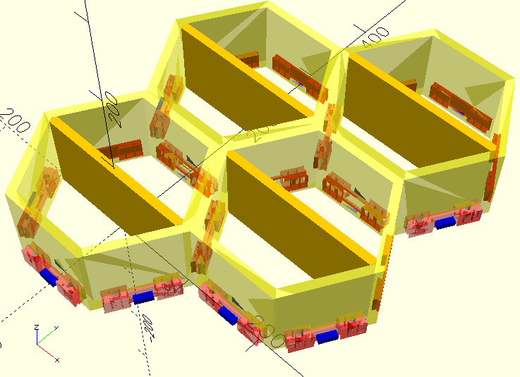

# Infinitely Extensible Modular Honeycomb Floating Shelf

This OpenSCAD script generates hexagonal floating shelf modules. 

## Printing

Print using PLA/PETG 

Recommended print settings:
- Layer height: 0.1-0.2mm adaptive
- Infill: 5% gyroidal
- Perimeters: 2

